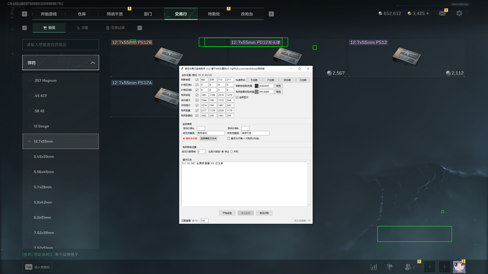
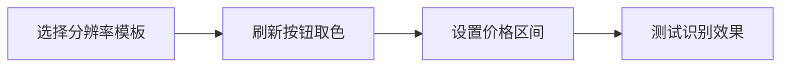
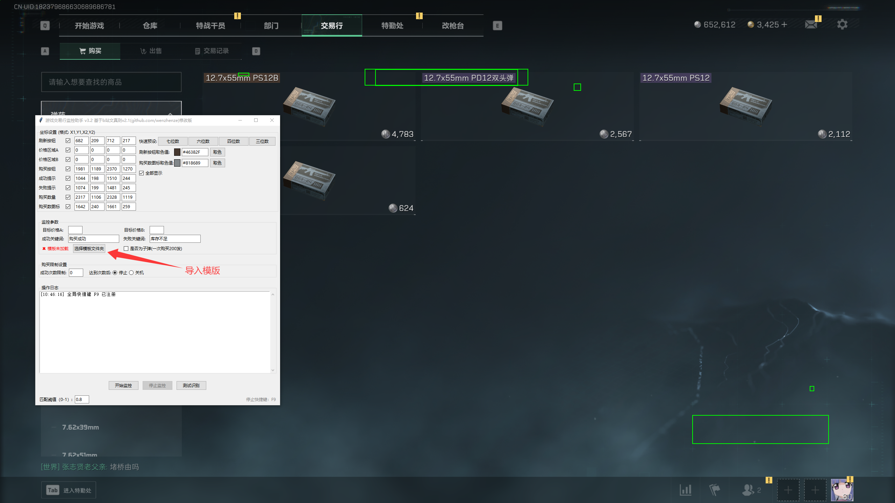
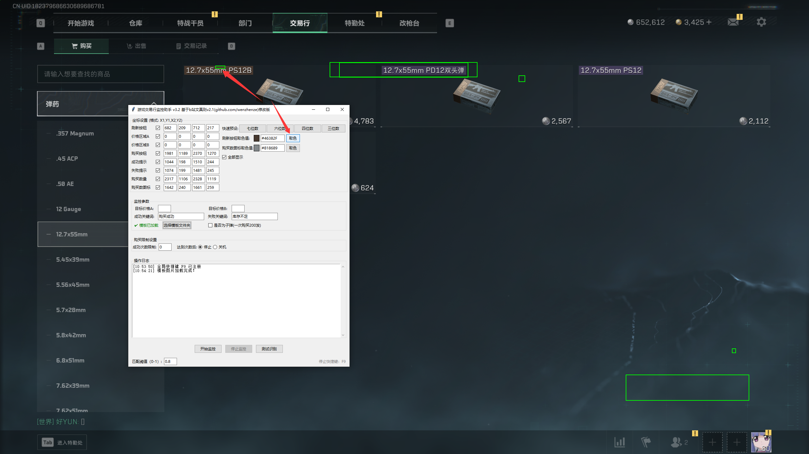
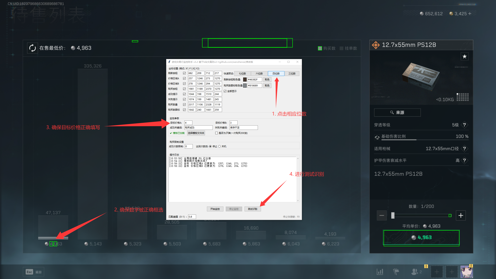

# 三角洲交易行监控工具

## 🎯 项目概述
自动化监控交易行工具，专为三角洲行动设计，可自动检测并抢购**低价钥匙卡**和**子弹**。官方补货大约时间为：
- 每日 **5:30 AM** 和 **5:00 PM**
- 每十五分钟不定期小批量随机补货



## ⚡ 核心功能
- **实时监控**：持续扫描交易行界面
- **智能识别**：精准检测低于市场价的商品
- **闪电购买**：毫秒级完成交易操作
- **OCR技术**：准确识别商品信息和价格

## 🚀 快速使用指南

### 第一步：启动工具
1. 从 [Release](https://github.com/kylerupinski/deltaforcecard-main/releases) 下载最新版本
2. 右键选择 **"以管理员身份运行"**
3. 启动游戏并打开交易行界面

### 第二步：基本配置


1. **导入模板**  
     
   点击"选择模版文件夹"导入对应分辨率模板

2. **取色设置**  
     
   点击取色按钮，选择刷新按钮颜色

3. **价格设置**  
     
   在"快速预设"中：
   - 选择价格位数
   - 输入目标价格范围（价格小于等于该范围将自动购买）

4. **测试识别**  
     
   确认价格区域能被正常识别：
   - 识别不准？**取消勾选框隐藏绿框**

### 第三步：开始监控
- 点击 **"开始监控"** 按钮
- 按下 **`F9`** 随时停止监控

> **重要提示**：确保交易行界面不被任何窗口遮挡（包括工具窗口）

## 🛠️ 开发者指南

### 环境要求
- Python 3.11.9
- Tesseract OCR + [中文语言包](https://github.com/tesseract-ocr/tessdata)

### 构建步骤
```bash
# 克隆仓库
git clone https://github.com/kylerupinski/deltaforcecard-main.git

# 进入项目目录
cd deltaforcecard-main

# 安装依赖
pip install -r requirements.txt

# 构建可执行文件
python build_exe.py
```

## 📜 许可协议
本项目采用 **[MIT License](LICENSE)**  

